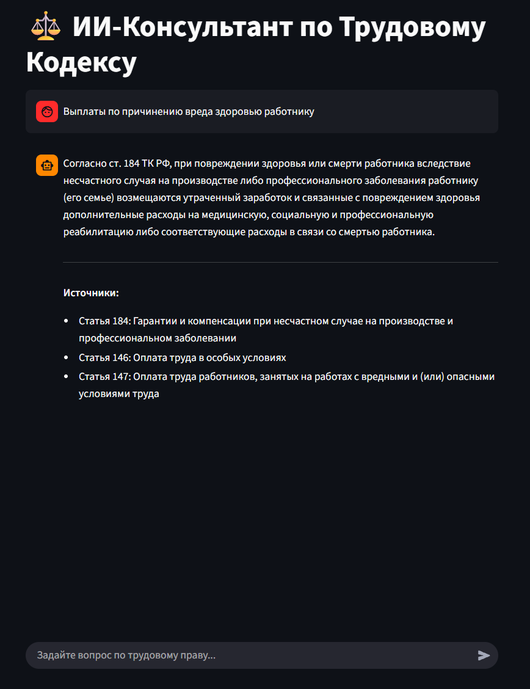

---

# ⚖️ AI Legal Assistant (RAG System on Russian Labor Code)

Интеллектуальный ассистент для консультаций по Трудовому Кодексу РФ. Проект реализует архитектуру **RAG (Retrieval Augmented Generation)** для поиска юридически точных ответов с ссылками на статьи закона, исключая «галлюцинации» нейросети.

Система работает полностью **локально (On-premise)**, обеспечивая 100% приватность данных.


## 🚀 Ключевые особенности

* **🔒 Privacy First:** Все компоненты (LLM, Векторная БД, API) работают внутри вашего контура. Данные не передаются в OpenAI или другие облака.
* **📚 Grounding & Citations:** Бот не придумывает законы. Каждый ответ подкреплен ссылками на конкретные статьи ТК РФ (см. скриншот).
* **🏗 Microservice Architecture:** Приложение разделено на независимые сервисы (Backend, Frontend, Inference), упакованные в Docker контейнеры.
* **🧠 Hybrid Context:** Используется специальная стратегия парсинга: очищенный текст для векторного поиска + полный юридический текст для генерации ответа.

## 🛠 Технический стек

* **LLM Inference:** [Ollama](https://ollama.com/) (Model: `gemma3` / `gemma3:4b` для оптимизации памяти).
* **Vector Database:** [ChromaDB](https://www.trychroma.com/) (Persistent storage).
* **Embeddings:** `sentence-transformers/paraphrase-multilingual-MiniLM-L12-v2`.
* **Backend:** FastAPI (Async REST API).
* **Frontend:** Streamlit.
* **ETL & Parsing:** Python-docx, LangChain (RecursiveCharacterTextSplitter).
* **DevOps:** Docker, Docker Compose.

## 🏗 Архитектура

Данные проходят следующий путь:

1. **Ingestion:** Парсинг `.docx` файлов ТК РФ  Очистка  Чанкинг с сохранением метаданных (Номер статьи, Раздел).
2. **Indexing:** Генерация эмбеддингов и сохранение в ChromaDB.
3. **Retrieval:** При запросе пользователя система находит топ-3 релевантных статьи по косинусному сходству.
4. **Generation:** Найденный контекст + Вопрос подаются в LLM (Gemma 3) через системный промпт, ограничивающий фантазию модели.

## ⚡ Как запустить проект

Проект полностью докеризирован. Вам понадобится установленный **Docker** и **Docker Compose**.

### 1. Клонирование репозитория

```bash
git clone https://github.com/ВАШ_ЮЗЕРНЕЙМ/labor-code-rag.git
cd labor-code-rag

```

### 2. Запуск сервисов

```bash
docker-compose up -d

```

*Docker скачает образы и запустит 3 контейнера: `ollama`, `backend`, `frontend`.*

### 3. Загрузка модели (Первый запуск)

Вам нужно скачать веса модели внутрь контейнера (это делается один раз):

```bash
# Для мощных ПК (требуется ~6GB RAM)
docker exec -it ragsystem-ollama-1 ollama run gemma3:4b

# ИЛИ для слабых ПК (требуется ~2GB RAM)
docker exec -it ragsystem-ollama-1 ollama run gemma2:2b

```

*(Если вы выбрали версию 4b, не забудьте поменять `MODEL_NAME` в `rag_generation.py` и пересобрать контейнер)*

### 4. Использование

Откройте браузер по адресу: **http://localhost:8501**

## 📂 Структура проекта

```text
├── ETL/                 # Скрипты для подготовки данных (парсинг, чанкинг)
├── assets/              # Изображения для README
├── chroma_db_data/      # Векторная база данных (игнорируется git)
├── api.py               # FastAPI Backend
├── ui.py                # Streamlit Frontend
├── rag_generation.py    # Логика RAG и работа с Ollama
├── vector_store.py      # Скрипт инициализации базы знаний
├── docker-compose.yml   # Оркестрация контейнеров
├── Dockerfile.api       # Сборка бэкенда
├── Dockerfile.ui        # Сборка фронтенда
└── requirements.txt     # Зависимости Python

```

## 🔧 Опыт разработки и Challenges

В процессе реализации столкнулся с проблемой **OOM (Out Of Memory)** при попытке запустить модель `gemma3:27b` внутри Docker. Контейнер падал с кодом 137.
**Решение:** Оптимизация потребления ресурсов путем перехода на модель `gemma3` (4b) и настройка лимитов памяти, что стабилизировало работу сервиса на стандартном оборудовании без GPU.

---

**Author:** Mikegix


